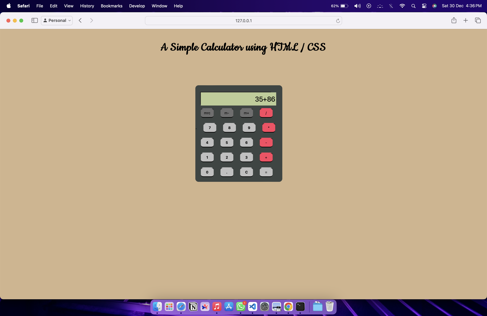

# Ex.08 Design of a Standard Calculator
## Date: 14.12.2023
## NAME: H. AARON
## Reference no: 23012368

## AIM:
To design a web application for a standard calculator with minimum five operations.

## DESIGN STEPS:

### Step 1:
Clone the github repository and create Django admin interface.

### Step 2:
Change settings.py file to allow request from all hosts.

### Step 3:
Use CSS for creating attractive colors.

### Step 4:
Write JavaScript program for implementing five different operations.

### Step 5:
Validate the HTML and CSS code.

### Step 6:
Publish the website in the given URL.

## PROGRAM :
```
views.py

from django.shortcuts import render

def simpleCalc(request):
    """function to implement the logic of the view for simpleCalc"""
    return render(
        request,
        'simpleCalc/simpleCalc/calc.html')

urls.py

from django.urls import re_path as url
from . import views

urlpatterns = [
    # redirect to simpleCalc view as a function
    url(r'^$',
        views.simpleCalc,
        name='simpleCalc'
        ),
]

base.html


<!DOCTYPE html>
<html>
   <head>
      <title></title>
      <link href="" rel="stylesheet">
	  <link href="https://fonts.googleapis.com/css2?family=Cookie&display=swap" rel="stylesheet"> 
   </head>
   <body>
      <div id="content">
         
         
      </div>
   </body>
</html>


calc.html


SIMPLE CALCULATOR App

   <!-- CSS property to create interactive calculator interface -->  
    <style>  
		body    
			{    
			background-color: tan;    
			}    
		.box    
			{    
			background-color: #3d4543;    
			height: 300px;    
			width: 270px;    
			border-radius: 10px;    
			position: relative;    
			top: 80px;    
			left: 40%;    
			}   
		.display    
			{    
			background-color: #222;    
			width: 220px;    
			position: relative;    
			left: 15px;    
			top: 20px;    
			height: 40px;    
			}    
		.display input    
			{    
			position: relative;    
			left: 2px;    
			top: 2px;    
			height: 35px;    
			color: black;    
			background-color: #bccd95;    
			font-size: 21px;    
			text-align: right;    
			}   
		.keys    
			{    
			position: relative;    
			top: 15px;    
			}    
		.button    
			{    
			width: 40px;    
			height: 30px;    
			border: none;    
			border-radius: 8px;    
			margin-left: 17px;    
			cursor: pointer;    
			border-top: 2px solid transparent;    
			}    
		.button.gray    
			{    
			color: black;  
			font-color: black;    
			background-color: #6f6f6f;    
			border-bottom: black 2px solid;    
			border-top: 2px #6f6f6f solid;    
			}  
		.title:hover {  
			color: #fff;  
			}  
		.title {  
			margin-bottom: 10px;  
			margin-top: 30px;  
			padding: 5px 0;  
			font-size: 40px;  
			font-weight: bold;  
			text-align: center;  
			color: black;  
			font-family: 'Cookie', cursive;  
			}  
			
		.button.pink    
			{    
			color: black;    
			background-color: #ff4561;    
			border-bottom: black 2px solid;    
			}    
		.button.black    
			{    
			color: black;    
			background-color: 303030;    
			border-bottom: black 2px solid;    
			border-top: 2px 303030 solid;    
			font-weight: bold;  
			}    
		.button.orange    
			{    
			color: black;    
			background-color: FF9933;    
			border-bottom: black 2px solid;    
			border-top: 2px FF9933 solid;    
			}    
		.gray:active    
			{    
			border-top: black 2px solid;    
			border-bottom: 2px #6f6f6f solid;    
			}    
		.pink:active    
			{    
			border-top:black 2px solid;    
			border-bottom:#ff4561 2px solid;    
			}    
		.black:active    
			{    
			border-top: black 2px solid;    
			border-bottom: #303030 2px solid;    
			}    
		.orange:active    
			{    
			border-top: black 2px solid;    
			border-bottom: FF9933 2px solid;    
			}    
		p    
			{    
			line-height: 10px;    
			}   
	</style>  
</head>  
<body>  
    <div class = "title" align="centre">  
        A Simple Calculator using HTML / CSS  
    </div>  
    <div class="box">    
        <div class="display">  
        <input type="text" readonly size="18" id="d">  
        </div>    
        <div class="keys">    
               <p> 
				<input type="button" class="button gray" value="mrc" onclick='c(0)'>  
				<input type="button" class="button gray" value="m-" onclick='c(0)'>  
				<input type="button" class="button gray" value="m+" onclick='c(0)'>  
				<input type="button" class="button pink" value="/" onclick='v("/")'> 
			   </p>    
               <p> .
				<input type="button" class="button black" value="7" onclick='v("7")'>  
				<input type="button" class="button black" value="8" onclick='v("8")'>  
				<input type="button" class="button black" value="9" onclick='v("9")'>  
				<input type="button" class="button pink" value="*" onclick='v("*")'> 
			   </p>    
               <p> 
				<input type="button" class="button black" value="4" onclick='v("4")'>  
				<input type="button" class="button black" value="5" onclick='v("5")'>  
				<input type="button" class="button black" value="6" onclick='v("6")'>  
				<input type="button" class="button pink" value="-" onclick='v("-")'> 
			   </p>    
               <p> 
				<input type="button" class="button black" value="1" onclick='v("1")'>  
				<input type="button" class="button black" value="2" onclick='v("2")'>  
				<input type="button" class="button black" value="3" onclick='v("3")'>  
				<input type="button" class="button pink" value="+" onclick='v("+")'> 
			   </p>    
               <p> 
				<input type="button" class="button black" value="0" onclick='v("0")'>   
				<input type="button" class="button black" value="." onclick='v(".")'>  
				<input type="button" class="button black" value="C" onclick='c("")'>  
				<input type="button" class="button orange" value="=" onclick='e()'> 
			   </p>    
        </div>    
	</div>   

	<script>  
		function c(val)    
			{document.getElementById("d").value=val;}    
		function v(val)    
			{document.getElementById("d").value+=val;}    
		function e(){    
			try    
				{c(eval(document.getElementById("d").value));}    
			catch(e)    
				{c('Error')}    
			}  
	</script>  
   



```
## OUTPUT:


## RESULT:
The program for designing a standard calculator using HTML and CSS is executed successfully.